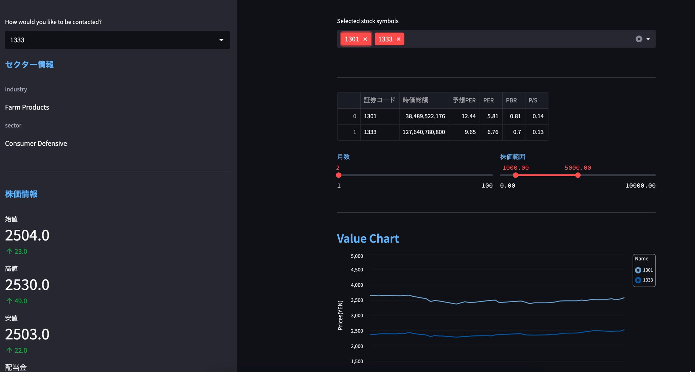

# 株価分析ツール

yfinance、yahooqueryを利用し、株式の分析を行う。

銘柄コードを選択することで株式指標が表示される。
 
# DEMO
 

 
# Features

分析に特化したstreamlitを使用したことで、短時間で開発することができる。

各種データは無料API/ライセンスフリーを利用して取得するため安心。
 
# Requirement
* requirements.txt参照
 
# Author
naoki0618
 
